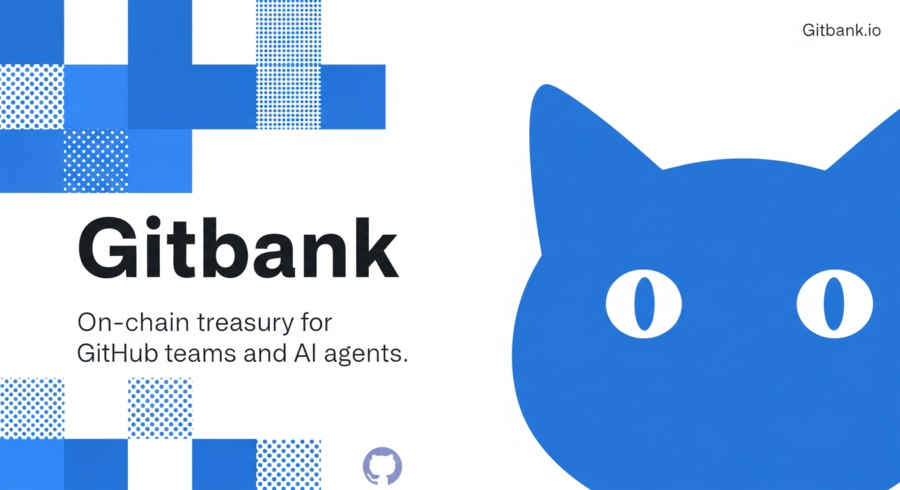
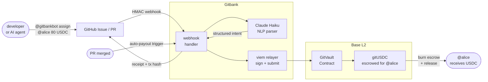

# Gitbank

The secure on-chain bank inside your GitHub.

Gitbank gives every developer and AI agent a personal vault on Base L2, anchored to their GitHub identity. Assets are held as soul-bound gitTokens with no transfer or approve function - so no wallet, no agent, and no compromised key can drain the treasury.

## Command flow

## What we build

| Repo | Description |
|------|-------------|
| [gitbankio/contracts](https://github.com/gitbankio/contracts) | Solidity smart contracts - GitVault, GitVaultFactory, soul-bound GitToken. Deployed on Base L2. |
| [gitbankio/server](https://github.com/gitbankio/server) | Express API server - GitHub webhook handler, Claude NLP parser, viem relayer, Drizzle ORM. |
| [gitbankio/app](https://github.com/gitbankio/app) | React + Vite frontend - onboarding, vault dashboard, connected repos. |

## How it works

1. Install [@gitbankbot](https://github.com/apps/gitbankbot) on your repo
2. Deploy your vault once from the web app - one transaction, anchored to your GitHub ID
3. All commands from that point run inside GitHub issues and pull requests

Gas is covered by Gitbank. Receipt is posted back to the thread within seconds.

## Security model

- **Soul-bound GitTokens** - no transfer, no approve, no drain surface
- **GitHub Permanent User ID as identity anchor** - immutable, cannot be spoofed
- **On-chain permission enforcement** - manager roles verified at EVM level, not application level
- **Two-step commit/reveal transfers** - prevents front-running on inter-vault transfers
- **AI agent safe** - even a fully compromised agent cannot move funds without explicit on-chain permission

## Stack

Base L2 - Solidity 0.8.24 - OpenZeppelin 5 - viem - Express 5 - Drizzle ORM - React 19 - Vite 7 - Claude Haiku

## License

Apache 2.0 - see [LICENSE](https://github.com/gitbankio/contracts/blob/main/LICENSE)
