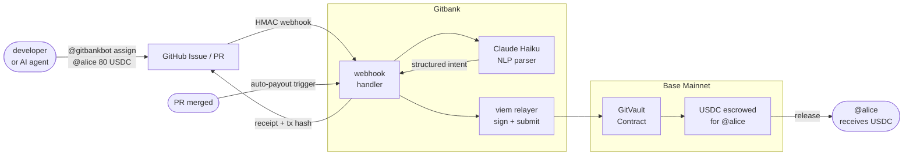

# Gitbank

On-chain treasury for GitHub teams and AI agents. Soul-bound vaults on Base mainnet, anchored to GitHub user IDs. All operations run via `@gitbankbot` mentions in Issues and PRs. Zero gas for users.

---

## Try it in the Playground

> No setup required. Post a comment and the bot responds.

1. Go to [gitbankio/playground discussions](https://github.com/gitbankio/playground/discussions)
2. Open any discussion thread
3. Mention `@gitbankbot` with a command:

```
@gitbankbot deposit 10 USDC
@gitbankbot swap 5 USDC to WETH
@gitbankbot send 20 USDC to @alice
@gitbankbot assign 50 USDC bounty to @bob for #42
```

The bot parses the intent, executes the transaction on Base mainnet, and posts a receipt with the tx hash. Gitbank covers all gas.

**[Browse playground discussions](https://github.com/gitbankio/playground/discussions)**

---

## Bot commands

| Command | Description |
|---------|-------------|
| `@gitbankbot deposit <amount> <token>` | Lock USDC or WETH into your vault |
| `@gitbankbot withdraw <amount> <token> to <address>` | Withdraw to any wallet address |
| `@gitbankbot swap <amount> <from> to <to>` | Swap USDC/WETH inside the vault via Uniswap v3 |
| `@gitbankbot send <amount> <token> to @user` | Transfer to another GitHub user's vault |
| `@gitbankbot create project <name> budget <amount>` | Create a project with a USDC budget |
| `@gitbankbot assign <amount> bounty to @user for #issue` | Assign a bounty to a contributor |
| `@gitbankbot launch token <name> <symbol>` | Launch a token on Base via Clanker (MCP only) |

---

## How it works



1. Install [@gitbankbot](https://github.com/apps/gitbankbot) on your repo
2. Deploy your vault once from [gitbank.io](https://gitbank.io) — one transaction, anchored to your GitHub ID forever
3. All commands run inside GitHub Issues and PRs from that point

---

## MCP server

Connect any MCP-compatible AI assistant directly to your Gitbank vault. No installation needed — just point to the live endpoint.

```
https://gitbank.io/api/mcp
```

Works with Claude Desktop, Cursor, VS Code Copilot, Grok, Kimi Code, and IBM watsonx.ai.

**Read tools** return live on-chain data instantly. **Write tools** queue a command and return a confirm code — the user posts it once on GitHub to authorize. GitHub account security (YubiKey, passkey, 2FA) is the only thing that matters.

| Tool | Type | Description |
|------|------|-------------|
| `get_vault_balance` | Read | WETH and USDC locked in the vault |
| `get_transactions` | Read | Recent deposits, withdrawals, swaps, payouts |
| `get_project_status` | Read | Project budget, spent, remaining, task list |
| `list_repos` | Read | GitHub repos with the bot installed |
| `check_pending` | Read | Poll status of a pending command by confirm code |
| `request_deposit` | Write | Lock USDC or WETH into the vault |
| `request_withdraw` | Write | Withdraw to any wallet address |
| `request_swap` | Write | Swap USDC/WETH via Uniswap v3 |
| `request_assign_bounty` | Write | Assign a bounty to a contributor for a GitHub issue |
| `request_launch_token` | Write | Launch a token on Base via Clanker (MCP-exclusive) |

Confirm codes expire in 10 minutes and are single-use. A stolen code is useless without GitHub account access.

---

## x402

Agent-to-agent HTTP payments on Base. No API keys. No accounts. Signed USDC via EIP-3009, settled on-chain.

```typescript
import { payX402 } from "@gitbank/x402";

const result = await payX402("https://api.example.com/data", privateKey);
```

See [gitbankio/x402](https://github.com/gitbankio/x402) for the full client library.

---

## AutoGit

AI app scaffolding. Describe an app, AutoGit generates a full React + Vite + TypeScript codebase using your own AI API key (OpenAI, Anthropic, Gemini, Groq, DeepSeek) and deploys it to GitHub Pages automatically. No terminal. No git commands.

Try it at [gitbank.io/autogit](https://gitbank.io/autogit/) or explore the [community hackathon](https://github.com/gitbankio/autogit-hackathon) — submit a prompt template and earn 5 USDC automatically when your PR merges.

---

## Security model

- **Soul-bound GitTokens** — no transfer, no approve, no drain surface. Cannot be phished via approval exploits.
- **GitHub Permanent User ID as identity anchor** — immutable integer, survives username renames, cannot be spoofed.
- **Two-signature security** — every state-changing vault call requires both the user execution keypair AND a short-lived relayer ECDSA signature. A leaked execution key alone cannot drain the vault.
- **Two-step commit/reveal transfers** — `initTransfer` + `finalizeTransfer` prevents front-running on inter-vault transfers.
- **On-chain swap whitelist** — `gitSwap` can only output WETH or USDC, enforced at the contract level.
- **AI agent safe** — even a fully compromised agent cannot move funds without an authorized GitHub webhook event.

---

## Deployed contracts (Base Mainnet)

| Contract | Address |
|----------|---------|
| GitVaultFactory | [`0xAA0a4ff46733EBaE8E658642A1314f18980fc77B`](https://basescan.org/address/0xAA0a4ff46733EBaE8E658642A1314f18980fc77B#code) |
| GitVault impl | [`0x3602197A1b445AA4746c47C9D69436d9B7cF5dc9`](https://basescan.org/address/0x3602197A1b445AA4746c47C9D69436d9B7cF5dc9#code) |
| Deployer / feeCollector | `0x1e660A9A1f1F08AFEF9c03c96D66260122464CF2` |
| relayerSigner | `0x750E6E4C5DF3483a6235D3DDAB4087266D6EF510` |

Deployed May 2026. Deployer pays all gas — zero ETH required on any user address.

---

## Repositories

| Repo | Description |
|------|-------------|
| [gitbankio/contracts](https://github.com/gitbankio/contracts) | Solidity smart contracts — GitVault, GitVaultFactory, soul-bound GitToken |
| [gitbankio/server](https://github.com/gitbankio/server) | Express 5 API server — webhook handler, Claude NLP parser, viem relayer |
| [gitbankio/app](https://github.com/gitbankio/app) | React 19 + Vite 7 frontend — onboarding and vault monitoring dashboard |
| [gitbankio/MCP](https://github.com/gitbankio/MCP) | MCP server — 5 read tools + 5 write tools via StreamableHTTP |
| [gitbankio/base-plugin](https://github.com/gitbankio/base-plugin) | Base MCP skill spec — load into any AI client via URL or file upload |
| [gitbankio/copilot-extension](https://github.com/gitbankio/copilot-extension) | GitHub Copilot extension — `@gitbankbot` directly in Copilot Chat |
| [gitbankio/kimi-plugin](https://github.com/gitbankio/kimi-plugin) | Kimi Code CLI plugin — MCP skill + manifest for one-command install |
| [gitbankio/gitbank-x](https://github.com/gitbankio/gitbank-x) | X bot — tweet replies execute on-chain vault transactions |
| [gitbankio/x402](https://github.com/gitbankio/x402) | x402 client — TypeScript library for EIP-3009 signed USDC payments |
| [gitbankio/autogit](https://github.com/gitbankio/autogit) | AutoGit — AI app scaffolding with one-click GitHub Pages deploy |
| [gitbankio/autogit-hackathon](https://github.com/gitbankio/autogit-hackathon) | Hackathon — submit a prompt template, earn 5 USDC on PR merge |
| [gitbankio/playground](https://github.com/gitbankio/playground) | Playground — try bot commands without installing anything |

---

## Stack

| Layer | Technology |
|-------|-----------|
| Chain | Base Mainnet (L2, chainId 8453) |
| Contracts | Solidity 0.8.34 + OpenZeppelin 5 + EIP-1167 minimal proxy |
| Onchain lib | viem |
| API | Express 5 + Node.js 24 + pino |
| Database | PostgreSQL + Drizzle ORM |
| Frontend | React 19 + Vite 7 + Tailwind v4 + framer-motion |
| NLP | Claude Haiku (Anthropic) |
| MCP | @modelcontextprotocol/sdk, StreamableHTTP, stateless |
| Auth | GitHub App (webhook HMAC + OAuth) |
| Language | TypeScript 5.9 |

---

## Links

- Web: [gitbank.io](https://gitbank.io)
- GitHub App: [github.com/apps/gitbankbot](https://github.com/apps/gitbankbot)
- MCP endpoint: `https://gitbank.io/api/mcp`
- Plugin download: [gitbank.io/api/public/plugin/download](https://gitbank.io/api/public/plugin/download)

## License

Apache 2.0
